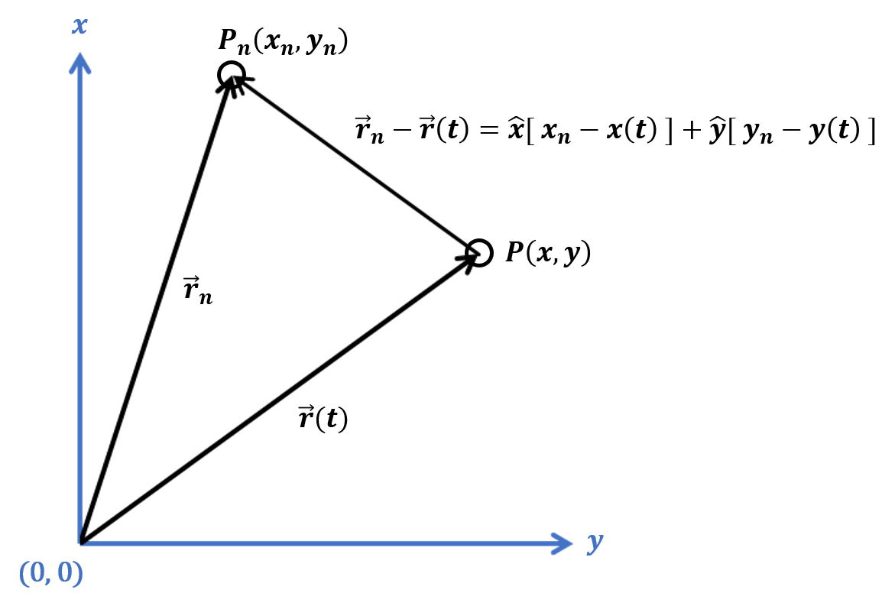

# pi-orbit
<i>Visualizing N Digits of Pi as Motion in an Inverse Square Force Field with Linear Resistance</i>
<hr>

<p align="justify">
    The location of the Nth digit of Pi is denoted by <i>P<sub>n</sub>(x<sub>n</sub>, y<sub>n</sub>)</i>, with position vector <b><i>r</b><sub>n</sub></i>. 
    The location of the particle is denoted by <i>P(x, y)</i>, with position vector <b><i>r</b>(t)</i>.
</p>
<p align="justify">
    Fixed at <i>P<sub>n</sub>(x<sub>n</sub>, y<sub>n</sub>)</i> is the source of a force field that accelerates the particle toward the source proportional
    to the inverse square of its distance from the source, where the distance and direction is given by <b><i>r</b><sub>n</sub></i> - <b><i>r</b>(t)</i>.
    Additionally, a linear resistive force acts on the particle.
</p>

<p align="center">
    
</p>

<p aling="center">
    The equation of emotion is below (1), where <i>k</i> is the force constant and <i>c</i> is the coefficient of friction.
    This is a second-order nonlinear ordinary differential equation. An approximate numerical solution is easily found.
</p>

<p align="center">
    
</p>

<p aling="center">
    If we evaluate the equation at <i>t = 0</i>, there is no longer any time dependence (2). 
    All values are constant at this instance. The nought subscript denotes a constant value.
</p>

<p align="center">
    
</p>

<p aling="center">
    Therefore, if we choose a small enough interval of time (time step) <i>Δt</t>, 
    we can treat all the values as approximately constant during this interval (3).
</p>

<p align="center">
    
</p>

<h1>Algorithm</h1>
<p>
    Provided <i>Δt</i> is close enough to zero and an initial value for 
    <i>x<sub>0</sub></i>, <i>y<sub>0</sub></i>, <i>ν<sub>x</sub><sub>0</sub></i> and <i>ν<sub>y</sub><sub>0</sub></i> is given,
    the following is calculated (4-7) at each interval <i>Δt</i> until the simulation ends.
</p>
<p align="center">
    
</p>

<p align="center">
    
</p>

<p align="center">
    
</p>

<p align="center">
    
</p>

<h1>Try It</h1>

```python
from piorbit import PiOrbit
```


```python
orbit = PiOrbit( n = 10, k = 10, c = 20, h = 0.01, lim = 0.1 )
orbit.start()
```
